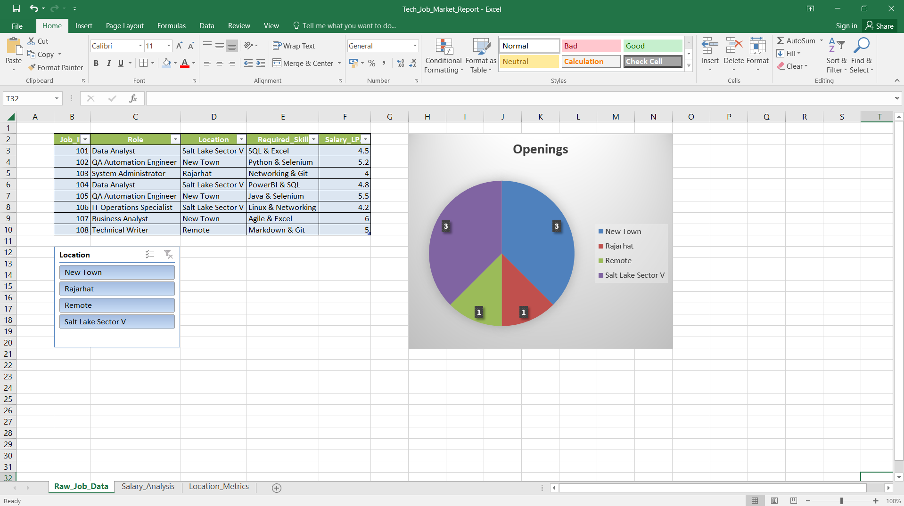

# Automated Tech Job Market Analyzer

A python-based data processing tool that aggregates regional tech job market data, performs metric analysis, and exports structured reports to Microsoft Excel for dynamic dashboard visualization.

## Features
- **Data Generation & Cleaning:** Simulates local market hiring trends (Kolkata tech hubs like Sector V / New Town).
- **Automated Analytics:** Utilizes Python (Pandas) to calculate average packages per role and demand distribution by location.
- **Excel Architecture:** Generates a multi-sheet workbook ready for corporate reporting.

## Tech Stack
- **Language:** Python
- **Libraries:** Pandas, OpenPyXL
- **Visualization:** Microsoft Excel (Pivot Tables, Slicers, Dynamic Charts)
- **Version Control:** Git

## Dashboard Preview

## How To Run
1. Install dependencies: `pip install pandas openpyxl`
2. Execute the script: `python analyzer.py`
3. Open `Tech_Job_Market_Report.xlsx` to view the generated data sheets.
